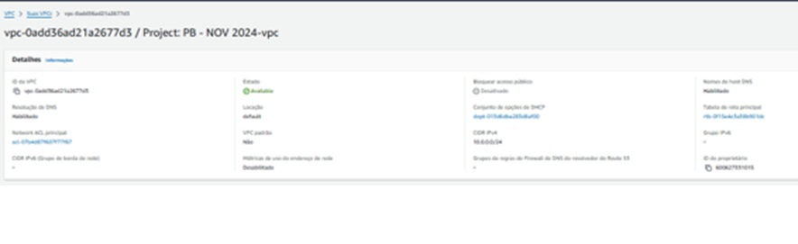

# Atividade - AWS - Docker
## Descrição
Este projeto visa a instalação e configuração do Docker no host EC2 da AWS, o deploy de uma aplicação Wordpress com um banco de dados MySQL utilizando RDS, configuração do serviço EFS para arquivos estáticos e configuração de um Load Balancer para a aplicação Wordpress.

## Requisitos
* Conta AWS

* Docker ou Containerd

* Script de Start Instance (user_data.sh)

* Wordpress

* RDS MySQL

* EFS AWS

* Load Balancer AWS (Classic)

* Git

## Instalação e Configuração

1. Instalação e configuração do Docker ou Containerd no host EC2
* Crie uma instância EC2 e use o script user_data.sh para instalar e configurar o Docker ou Containerd:
   ```bash	
   sh
   #!/bin/bash
   # Atualizar pacotes e instalar Docker
   sudo yum update -y
   sudo amazon-linux-extras install docker
   sudo service docker start
   sudo usermod -a -G docker ec2-user
   sudo chkconfig docker on

2. Deploy de uma aplicação Wordpress

* Deploy da aplicação Wordpress com um container de aplicação e RDS MySQL:
   ```bash
   sh
   # Dockerfile ou docker-compose.yml para Wordpress e MySQL

   # Exemplo de docker-compose.yml
   version: '3.1'

   services:
    wordpress:
        image: wordpress:latest
        ports:
            - "80:80"
        environment:
            WORDPRESS_DB_HOST: <RDS-endpoint>
            WORDPRESS_DB_USER: <DB-username>
            WORDPRESS_DB_PASSWORD: <DB-password>
            WORDPRESS_DB_NAME: <DB-name>
        volumes:
            - wp_data:/var/www/html

    mysql:
        image: mysql:5.7
        environment:
            MYSQL_ROOT_PASSWORD: <DB-root-password>
            MYSQL_DATABASE: <DB-name>
            MYSQL_USER: <DB-username>
            MYSQL_PASSWORD: <DB-password>
        volumes:
            - db_data:/var/lib/mysql

    volumes:
        wp_data:
        db_data:

3. Configuração do serviço EFS AWS

* Configure o EFS AWS para armazenar arquivos estáticos do Wordpress:

    1. Crie um sistema de arquivos EFS.

    2. Monte o EFS na instância EC2 e configure o volume no Docker.

4. Configuração do serviço de Load Balancer AWS
Configure um Load Balancer Classic para direcionar o tráfego HTTP para a aplicação Wordpress rodando na porta 80 ou 8080.

### Uso

### Acessar a aplicação Wordpress
* Após a configuração, acesse a aplicação Wordpress via o Load Balancer configurado.

### Pontos de Atenção
* Não utilizar IP público para a saída dos serviços WP.

* Sugerido utilizar LB para o tráfego de internet e EFS para pastas públicas e estáticos do Wordpress.

### Contribuição
* Utilize um repositório Git para versionamento.

* Criado documentação detalhada explicando o processo de instalação, configuração e deploy da aplicação.


---
### VPC 


Vpc criada para a divisão de sub-nets e disponibilidade de internet para ambas, vinculada a uma Tabela de Rota e uma Network ACL



Mapa Recursos


Mapa da VPC sobre como está configurada, onde mostra as sub-nets dentro da VPC (InstaciaDocker1, InstanciaDocker2) que estão vinculados a Tabela de Rotas para o trafego de rede para recursos que está vinculada a uma Network ACL.

CIDRs


IPV4 associado a VPC (10.0.0.0/24)

### Subnets
InstanciaDocker1


Subnet1 criada e vinculada a primeira instância criada na zona de disponibilidade us-east-1a com um CIDR (10.0.0.0/28), vinculada a Tabela de rotas para o trafego de rede para recursos e a VPC (Atividade Docker).

InstanciaDocker2


Subnet2 Criada e vincula a segunda instância criada na zona de disponibilidade us-east-1B com um CIDR (10.0.0.16/28), vinculada a Tabela de rotas juntamente a primeira subnet para o trafego de rede para recursos e a VPC (Atividade Docker).


### Route Tables

Vinculada a VPC (Atividade Docker) mais associação das duas subnets existentes e a um Internet Gatway para acesso à internet.


Rotas vinculadas a Route Table, tendo um Gatway de Internet vinculado e um ip local.

### Network ACL


Network ACL" (Listas de Controle de Acesso de Rede) em um serviço de nuvem, Controlar o tráfego de entrada e saída em sub-redes dentro de uma VPC.


Criada com o objetivo de fornecer portas e acesso para as seguintes funções:


* SSH: Libera o acesso a instancia a partir da chave gerada.
* NFS: Libera o acesso a função EFS, para que assim ambas as instâncias pudessem acessar um arquivo compartilhado pela função da própria AWS (EFS).
* HTTPS: Libera o acesso para o navegador para que a conexão seja criptografada.
* HTTP: Libera o acesso ao navegador para a comunicação da aplicação com o navegador.
* MYSQL/Aurora: Libera o acesso ao banco de dados criado pelo RDS.
* TCP personalizado: Liberar o acesso a porta 8080.


#### EFS


Criado para a compartilhar arquivos dentro de uma pasta especificada pelo usuário, vinculado as duas subnets existentes para ter acesso a endereço de IPV4 de cada subnet fazendo com que assim possa ser gerado uma conexão para ambas as instâncias.

#### Modelo da instância


#### Tags


### Load Balancer


* Tipo de Load Balancer: Application.
* Tipo de Endereço: IPV4.
* Zonas de Disponibilidade: 1A e 1B.
* Esquema: Internet-facing.


#### Mapeamento de Rede


* IPV4:10.0.0.0/24 (mesmo da VPC).
* Zonas 1A (10.0.0.0/28) e 1B (10.0.0.16/28).

Onde ele redireciona para ambas as zonas o acesso do cliente na aplicação.

### RDS (Banco Dados Mysql)


* Tipo de Rede: IPV4 Porta: 3306. 
* Sub-nets: 1A e 1B .
* Zona de Disponibilidade: 1B .

#### Configuração


Criado no nível gratuito vinculado a VPC mais as duas subnets existentes em zonas de disponibilidade diferentes (1A e 1B), com um armazenamento e com o intuito de servir como base para a conexão mais a instalação do WordPress.

Feito Tudo Isso (Criado o WordPress) com ip ac2 com a porta 8080


